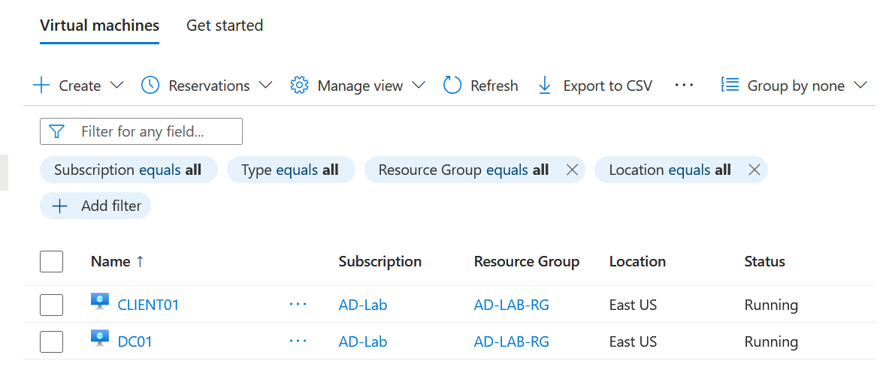
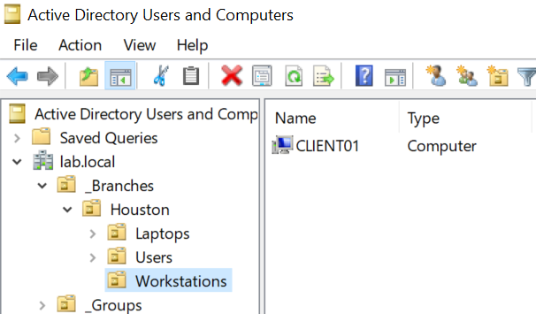
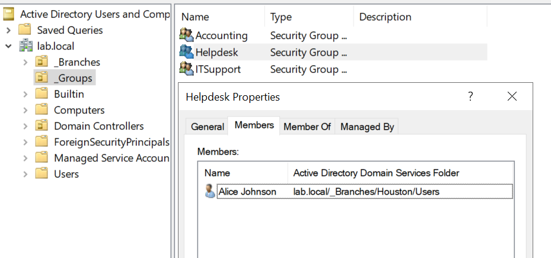
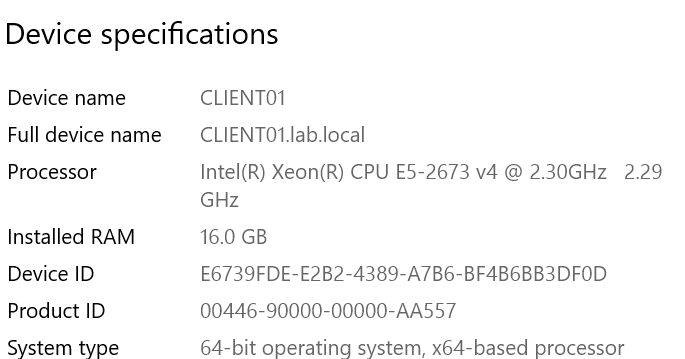
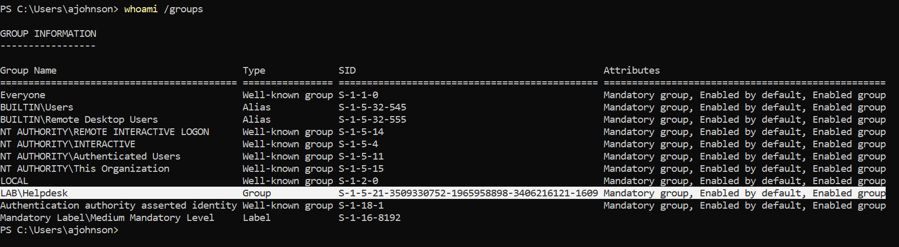
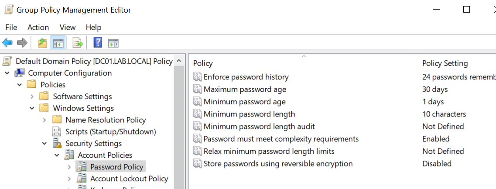
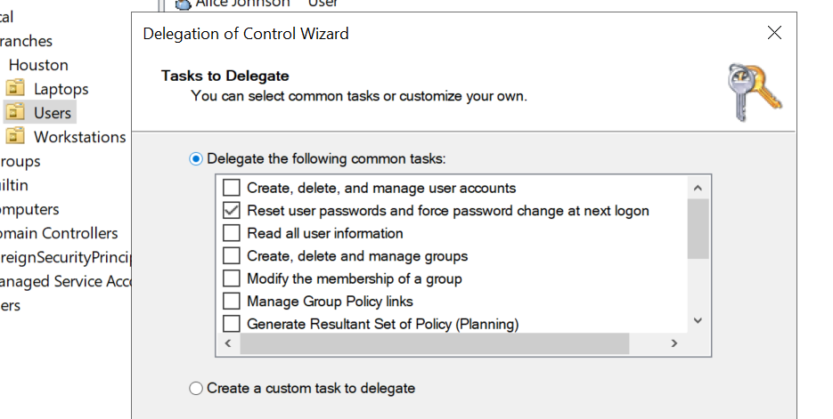

# Active Directory Domain Services (AD DS) Lab

This repository provides an overview of the entire process from the planning to the deployment and management of a secure and production-quality **Active Directory Domain Services (AD DS)** infrastructure. The project is hosted on **virtual infrastructure** on Microsoft Azure and emulates a real-world multi-site corporate network that adheres to the best industry practices of IAM, OU design, GPO implementation and admin delegation.

---

## Project Architecture & Design

### 1. Topology & Components
The environment comprises two main virtual machines running on the same Azure Virtual Network (VNet):

*   **Domain Controller (DC01):** This is a Windows Server 2022 Datacenter machine, which has been promoted to be a root domain controller within the forest `lab.local`. It has been assigned a static IP address to help keep the DNS and the authentication stable.
*   **Domain Client (CLIENT01):** This is a Windows Server 2022 Datacenter machine, which has been set up to work like a standard domain member workstation.

```
                  ┌──────────────────────────────────────────┐
                  │            Azure Virtual VNet            │
                  └────────────────────┬─────────────────────┘
                                       │
                  ┌────────────────────┴─────────────────────┐
                  ▼                                          ▼
       ┌────────────────────┐                     ┌────────────────────┐
       │   DC01 (WS 2022)   │                     │ CLIENT01 (WS 2022) │
       │  Domain Controller │                     │    Domain Client   │
       │    [lab.local]     │                     │                    │
       │                    │                     │   DNS pointing     │
       │ Static Private IP  │◄────────────────────┤   to DC01 IP       │
       └────────────────────┘  Domain Join & Auth └────────────────────┘
```

### 2. Logical Organizational Unit (OU) & Security Group Structure
The logical design follows the enterprise deployment in that the objects are structured according to **policy and delegation limits** (location-based) rather than a simple list:

*   **`_Branches` (Top-Level OU):** Holds locations specific to each branch.
    *   **`Houston` (Branch OU):** Represents a physical location.
        *   **`Users` (Sub-OU):** Holds users specific to each branch.
        *   **`Workstations` (Sub-OU):** Holds desktop computers specific to each branch.
        *   **`Laptops` (Sub-OU):** Holds laptops specific to each branch.
*   **`_Groups` (Top-Level OU):** All global security groups are held here in order to maintain an efficient and scalable RBAC structure.
    *   **`Helpdesk` (Global Security Group):** Global security group for tier-1 helpdesk staff.
    *   **`Accounting` (Global Security Group):** Global security group for financial staff.
    *   **
---

## Step-by-Step Implementation

### Phase 1: Deployment of Virtual Infrastructure (Azure)
1. Configured **DC01** as a Windows Server 2022 Datacenter VM, choosing an economic VM size (for example, Standard B2s) with standard SSD OS disks.
2. In the **Networking Tab**, created a new virtual network with subnets, enabling inbound **RDP (3389)** access through the NSG in order to connect and manage the VMs.
3. **Important Networking Note**: Went to the network interface (NIC) settings of **DC01** in the Azure portal and switched the **Private IP Assignment** to **Static** in order to avoid DNS and authentication issues in the local network.

### Phase 2: Installing AD DS & Domain Promotion
1. RDP’ed into the local administrator session of **DC01** and opened up the **Server Manager** console.
2. Used the **Add Roles and Features Wizard** to add the **Active Directory Domain Services (AD DS)** role and its management tools.
3. Launched the **Promotion Wizard** by clicking on the banner of Server Manager:
    * Created an entirely new Active Directory Forest with root domain `lab.local`.
    * Added the **DNS Server** and **Global Catalog (GC)** roles.
    * Set up a strong **Directory Services Restore Mode (DSRM)** password.
4. Rebooted the server and logged in using the domain administrator account (`LAB\Administrator`).


*The Domain Controller and Client Virtual Machines running within Microsoft Azure*

### Phase 3: Directory Structure Creation & User Provisioning
The knowledge of the administrative tools was proven by constructing the directory structure using both ADUC GUI and PowerShell scripts.

#### 1. Directory Structure Creation
*   Top-level OUs created: `_Branches` and `_Groups`.
*   Location OU created (`Houston`) and branch OUs (`Users`, `Workstations`, `Laptops`) nested with **Protect container from accidental deletion** checked.


*Nested OU hierarchy shown with the Client machine placed in its appropriate location*

#### 2. Provisioning Users and Groups (PowerShell)
Used PowerShell to create the departments, security groups, and users. Below is the PowerShell script run on **DC01** for provisioning of directory schema:

```powershell
# Define Target Paths
$ouUsers = "OU=Users,OU=Houston,OU=_Branches,DC=lab,DC=local"
$ouGroups = "OU=_Groups,DC=lab,DC=local"

# 1. Create Global Security Groups
New-ADGroup -Name "Helpdesk" -GroupScope Global -GroupCategory Security -Path $ouGroups
New-ADGroup -Name "Accounting" -GroupScope Global -GroupCategory Security -Path $ouGroups
New-ADGroup -Name "ITSupport" -GroupScope Global -GroupCategory Security -Path $ouGroups

# 2. Provision Users within Location-Specific OUs
New-ADUser -Name "Alice Johnson" -GivenName Alice -Surname Johnson -SamAccountName ajohnson -Path $ouUsers -AccountPassword (Read-Host -AsSecureString) -Enabled $true
New-ADUser -Name "Bob Martinez" -GivenName Bob -Surname Martinez -SamAccountName bmartinez -Path $ouUsers -AccountPassword (Read-Host -AsSecureString) -Enabled $true
New-ADUser -Name "Chris Walker" -GivenName Chris -Surname Walker -SamAccountName cwalker -Path $ouUsers -AccountPassword (Read-Host -AsSecureString) -Enabled $true

# 3. Establish Role-Based Group Membership
Add-ADGroupMember -Identity "Helpdesk" -Members ajohnson
Add-ADGroupMember -Identity "Accounting" -Members bmartinez
Add-ADGroupMember -Identity "ITSupport" -Members cwalker
```


*Security Groups created with Alice Johnson shown as a member of Helpdesk*

---

## 🔒 Client VM Integration & Authentication Testing

### 1. DNS Configuration
Prior to adding the client to the domain, the network adapter of **CLIENT01** was configured to refer to the static private IP address of **DC01** as its **Preferred DNS Server**. Otherwise, the client will not be able to find the domain controller's SRV records.

### 2. Domain Joining
*   Went into **Settings → System → About** from **CLIENT01** and clicked on **Join a domain**.
*   Entered `lab.local` as the desired domain, used the credentials for the domain administrator, and performed a system reboot.
*   After joining, checked whether the computer object of **CLIENT01** had been automatically added to the **Computers** container in Active Directory.


*Client Successfully connected to the Domain Controller via DNS*

### 3. Remote Desktop Access Delegation
For testing client-side authentication with Remote Desktop Protocol (RDP), which uses regular domain user credentials, the AD groups were put into the following client-side security group:

```powershell
# Grant RDP rights to Domain Security Groups on CLIENT01
Add-LocalGroupMember -Group "Remote Desktop Users" -Member "LAB\Helpdesk"
Add-LocalGroupMember -Group "Remote Desktop Users" -Member "LAB\Accounting"
Add-LocalGroupMember -Group "Remote Desktop Users" -Member "LAB\ITSupport"
```

### 4. Authentication and Token Verification
RDP'ed into **CLIENT01** as `LAB\ajohnson`. To demonstrate authentication and group policy/token validation, the command prompt was started and ran the following diagnostic command:

```cmd
whoami /groups
```

**Proof of Verification:** The above command was able to return active security identifiers (SIDs) for `LAB\Helpdesk` and `LAB\Domain Users` groups. This means that the Kerberos ticket generation, AD authentication, and security token construction are all working correctly.


*Authentication and group membership configuration is functioning properly.*

---

## 🛡️ Enterprise Hardening & Administration (Bonus Work)

In order to show some advanced sysadmin skills, a number of infrastructure changes were made:

### 1. Enforcing Password Policy (GPMC)
The **Default Domain Policy** was edited using the **Group Policy Management Console (GPMC)** in order to apply minimum security requirements for the organization:
*   **Path:** `Computer Configuration → Policies → Windows Settings → Security Settings → Account Policies → Password Policy`
*   Set up important variables: **Maximum password age** and **Minimum password length** in order to protect domain users against bruteforce attack.


*Group Policy Editing was used to enforce password requirements.*

### 2. SYSVOL Logon Scripting
Performed a hybrid-style automation script configuration in order to understand the concept of directory replication:
*   Wrote a simple `logon.bat` script:
    ```cmd
    @echo off
    echo Welcome to the domain
    ```
*   Put the script in the replicated folder of the domain: `C:\Windows\SYSVOL\sysvol\lab.local\scripts`
*   Specified `logon.bat` as **Logon script** property for user accounts in ADUC.

### 3. Helpdesk Administrative Delegation
Adhered to the **Principle of Least Privilege (PoLP)** by assigning particular domain permissions without giving Domain Admin rights:
*   Right-clicked the branch `Users` OU of `_Branches → Houston`.
*   Initiated the **Delegation of Control Wizard** and selected the **Helpdesk** global security group as the target.
*   Assigned permissions to:
    *   **Reset user passwords**
    *   **Force password change at next logon**

This way, the Helpdesk team is able to manage user tickets for Houston without full admin access.


*Delegating workloads to Helpdesk without giving full Domain Admin rights*

### 4. Active Directory Asset Lifecycle Management
Migrated the **CLIENT01** computer account from the unstructured default container **Computers** into the structured workspace OU of `_Branches → Houston → Workstations`. That ensures Group Policy targeting is applied to this asset.

---

## 💡 Core Competencies Shown
*   **Directory Services Management:** Planning and designing AD DS schemas.
*   **Cloud Infrastructure Management:** Deployment and integration of numerous cloud resources into Azure virtual networks with static IPs and NSGs.
*   **Scripting & Automation:** Scripting of PowerShell cmdlets to manage directories and create accounts.
*   **IAM Design:** Implementation of RBAC, GS groups, and user assignments.
*   **Security & Hardening:** Group Policy creation, password policy, administrative delegation, and logon triggers.
*   **Enterprise Problem Solving:** Problem analysis and solving of DNS resolution, Remote Desktop user permissions, and AD authentication flow problems.
